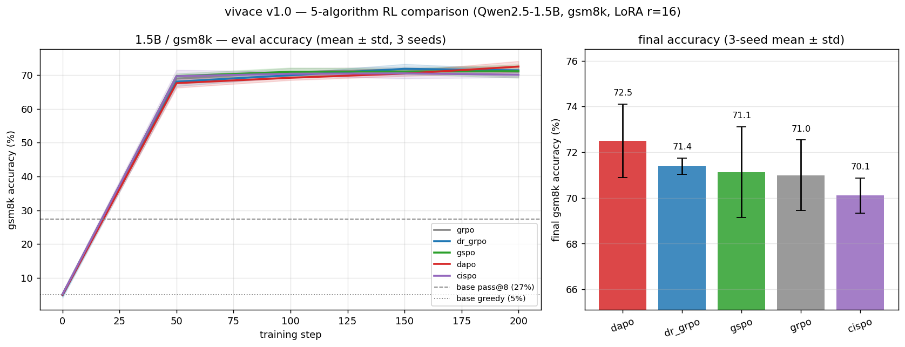
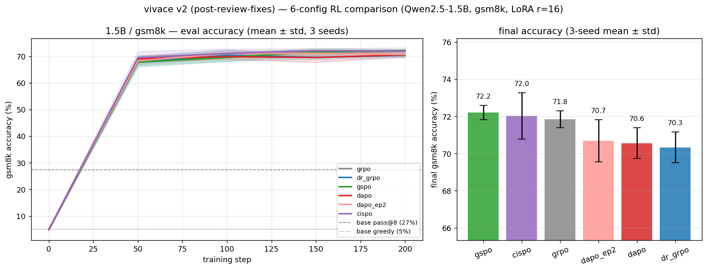
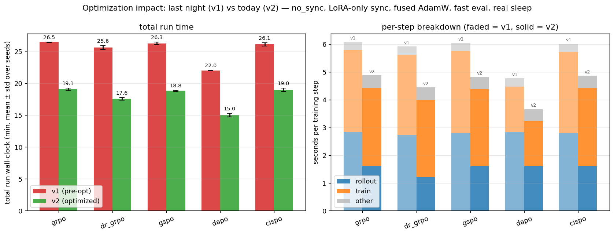
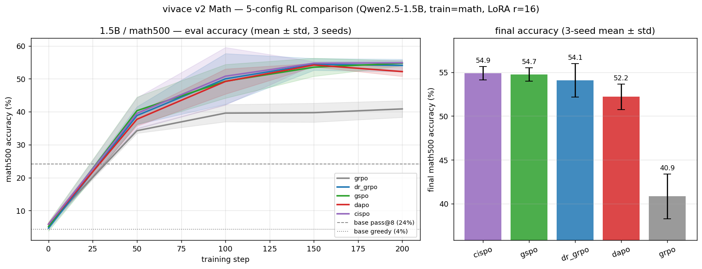

# v1.0 results

Running record of v1.0 benchmark results: three sweeps on Qwen2.5-1.5B base —
gsm8k v1, gsm8k v2 (after correctness + perf fixes), and Math.

Conventions: accuracy is greedy (T=0) on the full eval split, mean ± sample std
(ddof=1) across N=3 seeds {7, 13, 42}. Seeds are collision-proof per-rank via
the `cfg.seed + 1000*rank` derivation (see trainer). All algos use
`adaptive_sampling=True`, `temperature=0.7`.

**Background — 0.5B pilots.** The benchmark started at 0.5B/gsm8k and moved to
1.5B after the pilots stalled: Qwen2.5-0.5B-base has gsm8k pass@8 ≈ 0.53%,
so rollout groups almost never contained a correct answer. GRPO collapsed onto
the format-reward plateau (~2% accuracy); the RLOO-family algorithms learned
but with seed variance dominating single-seed cells — the per-algo "best
recipes" carried into 1.5B come from that regime and should be read
accordingly. 1.5B is the smallest base where correct rollouts are common
enough for group-relative advantages to carry signal.

---

## 1.5B / gsm8k — 5-algorithm × 3-seed comparison (local, 2×4090)

Qwen2.5-1.5B base, LoRA r=16, max_new=192, 200 steps. Trained on gsm8k; eval on
gsm8k + math500 (generalization probe). Run 2026-06-09, wandb groups
`overnight-1.5b-gsm8k-20260609_0140_{algo}`.

*Left: gsm8k eval accuracy vs step (mean ± std over 3 seeds), all five algos
nearly overlapping, crossing base pass@8 (~27%) by step ~18. Right: final
accuracy bars with seed error bars — every algo's interval overlaps the others.
Regenerate with `tools/plot_benchmark.py`.*

| algo | gsm8k acc (mean ± std) | math500 acc (mean ± std, corrected) |
|---|---|---|
| DAPO | 72.50 ± 1.61 | 34.13 ± 2.27 |
| Dr.GRPO | 71.39 ± 0.36 | 38.07 ± 1.81 |
| GSPO | 71.14 ± 1.98 | 37.33 ± 2.25 |
| GRPO | 70.99 ± 1.55 | 35.87 ± 3.06 |
| CISPO | 70.10 ± 0.77 | 35.20 ± 3.61 |

> **math500 correction (2026-06-10).** The original eval verifier matched
> answers float-only, mis-scoring the 35.4% of MATH-500 ground truths that
> aren't plain numbers (fractions, radicals, intervals) — the published
> math500 column was 25-28%, an undercount of ~10pp. Fixed in commit `9f3027e`
> (evals now use the env-owned `is_correct`, same math_verify path as training
> rewards); the table above was recovered offline from the saved eval dumps via
> `tools/rescore_evals.py`, no re-runs needed. gsm8k numbers were unaffected
> (0 flips on re-score). Base pass@K references were always computed through
> the training-reward matcher and remain valid.

Per-seed gsm8k finals:

| algo | seed 7 | seed 13 | seed 42 |
|---|---|---|---|
| GRPO | 69.3 | 71.3 | 72.3 |
| Dr.GRPO | 71.3 | 71.1 | 71.8 |
| GSPO | 70.9 | 69.3 | 73.2 |
| DAPO | 71.2 | 74.3 | 72.0 |
| CISPO | 69.2 | 70.5 | 70.6 |

**Base reference** (Qwen2.5-1.5B, `tools/pass_at_k.py`):
gsm8k pass@1 = 5.08%, pass@8 = 27.37% · math500 pass@1 = 4.40%, pass@8 = 24.20%.

### Findings

1. All five algos land in 70.1-72.5% on gsm8k — means within 2.4pp, seed
   error bars overlapping heavily. DAPO has the highest mean but its ±1.61
   overlaps every other algo. This inverts the 0.5B pilot, where GRPO
   collapsed to ~2% and the RLOO family finished ~40pp ahead: algorithm choice
   dominates when the base is below the capability threshold (0.5B) and
   largely vanishes once the base can produce correct rollouts (1.5B).

2. GRPO trains normally at 1.5B (71.0% ± 1.5), matching the RLOO family
   throughout, after collapsing at 0.5B. The 0.5B mechanism: with base gsm8k
   pass@8 at 0.53%, almost no group had a correctness split, so within-group
   spread was format jitter (~1e-3). GRPO's z-scored advantage
   `(r − mean)/(std + adv_eps)` is bounded (|adv| ≤ √(G−1)) but rescales that
   jitter to unit magnitude, so noise groups drove the policy at full weight
   onto the format plateau; RLOO's advantage scales with the raw spread
   (`adv_type` swap alone: 1.1% → 44.0%). At 1.5B (pass@8 = 27%) groups
   carry real correctness variance and the pathway never opens.

3. The gain is capability creation rather than sampling-collapse: all RL runs reach ~71% on
   gsm8k vs base pass@8 = 27.4% — RL produces ~44pp more correct greedy
   answers than 8-sample base sampling reaches; the correct answers RL elicits
   are not reachable by the base within 8 samples at any temperature. At 0.5B
   the same gap: base pass@8 0.53% → RL 49%.

4. gsm8k RL generalizes to math500 beyond the base sampling ceiling. Models
   trained only on gsm8k reach 34-38% on math500 (unseen, harder competition
   math) vs base greedy 4.40% and base pass@8 24.2% — with the corrected
   verifier, transfer clears the base's 8-sample ceiling by 10-14pp. gsm8k RL
   creates capability on a harder held-out distribution rather than collapsing
   sampling onto it. No algorithm separates (Dr.GRPO highest at 38.1 ± 1.8;
   math500 seed noise runs ±1.8-3.6).

### Caveats

- Single training env (gsm8k). The Math sweep below separates only GRPO
  (−13pp); the RLOO family stays within 2.7pp.
- 200 steps, LoRA r=16. Full-FT or longer training could spread the algos.
- math500 is an *eval-only* generalization probe here, not a training target.
- These are 1.5B numbers. The 0.5B pilots (algorithm choice separating by ~40pp, GRPO
  collapsing) and this run (algorithms converging) bracket the base model's
  capability threshold as the variable that decides whether algorithm choice
  matters; the Math run probes the same question through the training
  distribution instead of the model — and drops GRPO 13pp (Math finding 4).

---

## 1.5B / gsm8k v2 — re-run after correctness + perf fixes (local, 2×4090)

Same protocol as v1 (Qwen2.5-1.5B base, LoRA r=16, max_new=192, 200 steps,
3 seeds), re-run 2026-06-10 after a batch of fixes landed: env-owned eval
verifier, global token-norm for token-level losses (DAPO/CISPO),
comma-grouped gsm8k answers, xmlcount fix, adapter weight saving, real vLLM
sleep mode (colo `gpu_memory_utilization` 0.25→0.65), and the training/eval
perf batch (no_sync, LoRA-only sync, fused AdamW, one-call eval generation +
parallel math_verify). Wandb groups `gsm8k-v2-20260610_1029_{algo}`.
18/18 runs clean.

### Rollout top_p A/B (pre-registered decision)

Training-rollout `top_p=0.95` deviates from the paper-standard 1.0, so the
choice was A/B-tested first. DAPO (ep=1) × 3 seeds per arm, paired by seed
(groups `topp-ab-dapo-1.5b-gsm8k-20260610_0210_tp{0.95,1.0}`):

| arm | final gsm8k | per-seed (7/13/42) |
|---|---|---|
| top_p=0.95 | 70.76 ± 1.07 | 69.5 / 71.3 / 71.4 |
| top_p=1.0 | 69.57 ± 0.05 | 69.6 / 69.5 / 69.6 |

0.95 is ahead on two of three paired seeds (+1.8pp at s13/s42, tie at s7) and
was used for the full v2 sweep. tp=1.0 is nearly seed-invariant (±0.05).
Figure: `figures/topp_ab_dapo_1.5b_gsm8k.png`.

### Results

| algo | gsm8k acc (mean ± std) | math500 acc (mean ± std) | gsm8k per-seed (7/13/42) |
|---|---|---|---|
| GSPO | 72.20 ± 0.39 | 36.87 ± 1.21 | 72.6 / 72.1 / 71.9 |
| CISPO | 72.02 ± 1.25 | 35.20 ± 1.06 | 70.7 / 72.1 / 73.2 |
| GRPO | 71.85 ± 0.46 | 35.40 ± 0.20 | 72.3 / 71.3 / 71.9 |
| DAPO (ep=2) | 70.68 ± 1.14 | 37.60 ± 1.78 | 70.7 / 69.5 / 71.8 |
| DAPO (ep=1) | 70.56 ± 0.83 | 35.47 ± 1.90 | 69.6 / 71.0 / 71.0 |
| Dr.GRPO | 70.33 ± 0.83 | 36.20 ± 3.34 | 69.4 / 70.8 / 70.8 |

### Findings

1. GSPO has the highest gsm8k mean and the tightest seed spread (±0.39; GRPO
   next at ±0.46); on math500 only DAPO ep=2 (37.6) edges it (36.9). The top-3
   (GSPO/CISPO/GRPO) remain statistically inseparable on gsm8k; the resolved
   gap is top-3 vs DAPO/Dr.GRPO (~1.5pp). GSPO's mid-pack v1 rank sits within
   the same seed noise, plus the v1 eval verifier issue on math500.

2. DAPO ran ep=1 in v1 while all other algos ran ep=2 — an `optim_epochs`
   value inherited from a 0.5B pilot cell in the seed-variance-dominated
   regime. A 3-seed ep=2 addendum (`gsm8k-v2-20260610_1029_dapo_ep2`): gsm8k
   unchanged (70.68 vs 70.56); math500 improved on all three paired seeds
   (+2.8/+2.0/+1.6, mean +2.1), the best math500 cell in the sweep. More
   optimization per batch improved transfer rather than in-domain accuracy. Configs
   and the generator now default DAPO to ep=2 (budget-matched).

3. Clipping is inert. DAPO ep=1's `clip_frac` ≡ 0 is structural (at
   `optim_epochs=1` the ratio is exactly 1); at ep=2 DAPO's clip-higher
   touches ≤1.2% of tokens/step (mean ~0.4%), CISPO's IS-clip ≤1e-4, GSPO 2
   sequences in one seed. At 200 steps / 192 tokens /
   near-saturation-by-step-50, this benchmark measures recipe fit (LR, update
   count), not the long-horizon failure modes those mechanisms target. Math
   (768 tokens) changes nothing here (DAPO ≤0.5%, CISPO/GSPO 0) and separates
   only GRPO (Math finding 4).

4. Run-to-run nondeterminism is ~0.3pp at fixed seed (config-identical DAPO
   tp0.95/s13 runs: 71.3 A/B vs 71.0 v2) — vLLM batched generation is not
   deterministic. Differences under ~0.5pp are unresolvable even at fixed
   seed.

### Wall-clock (perf-optimization validation)

| algo | v1 min/run | v2 min/run | speedup |
|---|---|---|---|
| GRPO | 26.5 | 19.1 | 1.39× |
| Dr.GRPO | 25.6 | 17.6 | 1.46× |
| GSPO | 26.3 | 18.8 | 1.40× |
| DAPO (ep=1) | 22.0 | 15.0 | 1.47× |
| CISPO | 26.1 | 19.0 | 1.38× |

Per-step breakdown (`figures/v2_wallclock.png`): rollout time nearly halved
(~2.8s → ~1.6s/step; real sleep mode + the larger 0.65 vLLM pool), train time
−20% (no_sync + LoRA-only sync + fused AdamW), gsm8k full-split eval 27s →
5.1s. DAPO's shorter runs are ep=1 (one optimizer pass per batch). No accuracy
cost for GRPO/GSPO/CISPO (+0.9/+1.1/+1.9pp); DAPO (72.5→70.6) and Dr.GRPO
(71.4→70.3) dropped — see caveats.

### Caveats

- v1→v2 accuracy deltas conflate the perf batch with behavioral fixes: global
  token-norm changed DAPO/CISPO gradients (the two algos that moved ~2pp
  between sweeps, in opposite directions). v2 is the table to use.
- Per-algo LRs (GSPO 1e-4, GRPO/Dr.GRPO/DAPO 8e-5, CISPO 6e-5) were carried
  from 0.5B pilot picks in a regime later shown to be seed-noise-dominated.
  GSPO's higher LR has a principled motivation (sequence-level ratios →
  gentler updates), but the cross-algo ordering should be read as "these
  recipes at these budgets," pending a proper 1.5B LR sweep (cluster phase).
- math500 seed noise (±1.1-3.3) is still ~3× gsm8k's; 3 seeds resolve ~2pp
  differences there at best.

---

## 1.5B / Math — 5-algorithm × 3-seed (local, 2×4090)

Qwen2.5-1.5B base, LoRA r=16, trained on Hendrycks MATH (max_new=768,
max_prompt=512), 200 steps. Eval on gsm8k + math500 + AIME 24/25/26. The
original pick was DAPO/CISPO/Dr.GRPO; GSPO was added on its gsm8k v2 result
and GRPO as the reference algorithm. Run 2026-06-10/11, wandb groups
`math-1.5b-20260610_1616_{gspo,dapo,cispo,dr_grpo,grpo}`. 15/15 runs clean,
~53 min/run (colo with real sleep at `gpu_memory_utilization` 0.65; the
earlier 0.22 setting predates sleep mode).

| algo | math500 (in-domain) | gsm8k transfer* | AIME 24/25/26 — % (n of 90) |
|---|---|---|---|
| CISPO | 54.87 ± 0.76 | 67.95 ± 3.60 | 2.2% (2) / 0.0% (0) / 3.3% (3) |
| GSPO | 54.73 ± 0.76 | 67.73 ± 2.14 | 5.6% (5) / 1.1% (1) / 1.1% (1) |
| Dr.GRPO | 54.07 ± 1.90 | 68.24 ± 1.30 | 4.4% (4) / 0.0% (0) / 2.2% (2) |
| DAPO (ep=2) | 52.20 ± 1.44 | 69.42 ± 1.43 | 3.3% (3) / 2.2% (2) / 0.0% (0) |
| GRPO | 40.87 ± 2.54 | 56.86 ± 2.57 | 0.0% (0) / 1.1% (1) / 1.1% (1) |

*gsm8k transfer = post-hoc re-eval of saved adapters at a 1024-token budget
with boxed-first answer extraction (`tools/reeval_budget.py`); the in-run
numbers carry the two eval artifacts in finding 3.

### Findings

1. Training on MATH moves math500 from ~35-37 (gsm8k-trained) to 52-55
   (+17pp; base pass@8 24.2), and costs ~4pp on gsm8k (~72 → ~68). If you can
   afford the ~2.7× longer rollouts, train on the harder distribution.

2. Within the RLOO family the ordering reshuffles again and stays within
   ~2.7pp. CISPO/GSPO lead in-domain (both ±0.76, the tightest spreads); DAPO
   is last of the four in-domain and highest on gsm8k transfer. Together with
   gsm8k v2 (GSPO highest, DAPO/Dr.GRPO lowest): at 1.5B/LoRA/200-step
   budgets, the choice among the RLOO-style algorithms moves results by ≲2pp
   around a recipe-dominated mean. GRPO is the exception — finding 4.

3. The in-run gsm8k transfer numbers carry two eval artifacts (published
   range 0-56%, format rates 50-100%):
   - *Truncation*: Math-trained models write long solutions; at the gsm8k
     eval budget of 256 tokens, 33-62% of responses were capped before the
     answer. At 1024, cap rate is 0.2-0.8%.
   - *Format transfer*: the models answer gsm8k Math-style — the full solution
     inside `<answer>` ending in `\boxed{N}` — which the gsm8k tag+float
     matcher scores 0 (CISPO seed-7: 0.0% in-run, 71.95% re-evaluated).

   Both only suppress scores. Budget A/B on the 12 non-GRPO checkpoints:
   512 vs 1024 differ by <0.2pp for three algos (+1.0 for DAPO), and eval
   wall-clock is identical (~20-25 s) since almost nothing reaches either cap.

4. GRPO lands 13pp under the other four algorithms in-domain (40.9 vs ~54) and
   12pp under on transfer (56.9 vs ~68), the deficit reproducing on all three
   seeds (39.4/39.4/43.8). Training reward barely shows it (per-seed means
   0.88-0.98 vs 1.03-1.13 for the RLOO family; per-step values swing ±0.5);
   length and gradients do: every algo dips to ~215-380 tokens by step 50,
   then the RLOO family grows back to 430-650 while GRPO ends at 272/263/461,
   and GRPO's grad norm runs 3× Dr.GRPO's (0.09-0.10 vs 0.03; 1.2-1.7× the
   others). Hypothesis, the 0.5B story one level up: on MATH nearly every
   group has *some* spread (length/format) but not all have a solved/unsolved
   split, and GRPO's per-group z-score weights both alike — `advantage_std`
   sits at its ceiling 1.008 on nearly every step (min 0.80) vs Dr.GRPO's
   0.48-1.35 tracking real spread. Confound: GRPO also runs
   `kl_coef` 0.04 (Dr.GRPO 0, the rest 0.01); no 1.5B/MATH `adv_type`-only
   isolation yet. gsm8k (pass@8 27%) sits above GRPO's operating threshold;
   MATH at 1.5B does not — the threshold is a property of the training
   distribution as much as the model. At these budgets, RLOO-style advantages
   (Dr.GRPO/GSPO/DAPO/CISPO) are the safer default when the base's solve rate
   on the training distribution is low.

5. AIME is at the floor for 1.5B greedy decoding. Totals across 15 runs:
   aime24 14/450 (3.1%), aime25 4/450 (0.9%), aime26 7/450 (1.6%). aime24 is
   elevated vs both later years (consistent with leakage into the Qwen2.5
   corpus *or* an easier problem set), but the 25 < 26 inversion breaks a
   clean recency-contamination gradient — at these counts the signal is too
   small to call. Worth re-testing at 3B/7B where absolute rates are higher.

### Follow-ups proposed (not yet applied)

- Math configs: gsm8k `eval_max_new_tokens` 256 → 1024 (matches math500's
  budget; zero wall-clock cost at observed cap rates) + generator.
- gsm8k eval matcher: adopt boxed-first extraction (same loosening-only class
  as the comma fix) so cross-domain evals score Math-format answers. Training
  rewards left untouched — only the env-owned eval `is_correct`.

---

## Reproduce

- **Configs** — `tools/gen_benchmark_configs.py` regenerates
  `vivace/configs/experiments/v1_1.5b/`.
- **Runs** — `tools/run_2x4090_gsm8k_3seed.sh` (gsm8k v1) and
  `tools/run_2x4090_math_3seed.sh` (Math, minus GRPO); 3 seeds × the configs
  in `vivace/configs/experiments/v1_1.5b/`.
- **Aggregation** — `tools/aggregate_seeds.py` produces the mean ± std tables.
- **Plots** — `tools/plot_benchmark.py`, `tools/plot_topp_ab.py`,
  `tools/plot_wallclock.py`.
- **Offline re-scoring** — `tools/rescore_evals.py` (re-score saved eval dumps
  through a fixed verifier), `tools/reeval_budget.py` (re-eval saved adapters
  at a different token budget / extraction).

## Pending

- **Cluster** 3B/7B headline runs.
- **GSPO clip band.** The bf16-noise premise for an fp32-epsilon re-test was
  refuted (0.5B eps sweep 2e-3…0.2: 40-45%, flat within seed noise); the
  3-seed 1e-2-vs-0.2 check is still unrun, so GSPO rows use clip 0.2.
